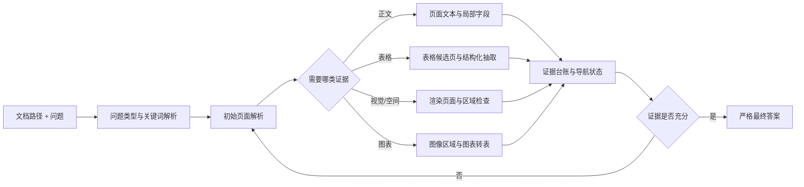

# 多模态文档理解智能体项目设计

## 1. 项目定位

本项目面向“给定一份本地文档和一个问题，智能体通过多轮工具调用找到证据并回答问题”的任务。核心能力不是一次性阅读后生成摘要，而是让智能体在有限的交互轮次内完成：

1. 判断问题需要哪一种证据；
2. 选择合适的文档工具；
3. 根据工具观察决定下一步动作；
4. 在文本、表格、版面和图像之间切换；
5. 将最终答案绑定到已经获取的证据。

支持的文档形态包括 PDF、DOCX、PPTX、图片、Markdown 和普通文本。智能体既可以处理纯文本问题，也可以处理表格数值、图表数据、版面位置、图片内容和 OCR 场景。

项目的基本设计单位是一条完整任务轨迹：任务输入是文档路径和问题，轨迹中交替出现智能体动作与工具观察，最终以一个严格的最终答案动作结束。

## 2. 设计目标

- **证据优先**：最终答案应来自文档中实际取得的文本、结构化表格、版面元素或图像证据，不依赖无依据猜测。
- **工具自适应**：工具选择由问题类型和当前观察共同决定，不要求所有问题都走同一条固定流程。
- **渐进式检索**：先用低成本方式发现页面和候选区域，再用更专门的工具获取局部证据。
- **多模态闭环**：工具返回的图片不只是路径记录，而要作为下一轮模型输入的一部分参与判断。
- **状态可追踪**：页面、区域、表格、图像、证据和搜索进度都要显式记录，避免重复调用和错误终止。
- **失败可恢复**：后端缺失、专用工具失败或返回格式异常时，给出明确错误和替代路线，不伪造结果。
- **有界执行**：多轮搜索有明确的轮次、工具调用、观察长度和并发边界，保证每条轨迹都能结束并可审计。

## 3. 总体方法



每一轮都遵循相同的环境交互闭环：

1. 智能体读取当前任务、历史观察和导航状态；
2. 智能体输出一个完整动作：工具调用或最终答案；
3. 系统校验动作协议、工具名称和参数；
4. 工具在本地文档上执行并返回结构化结果；
5. 系统将结果转换为下一轮的文本观察，必要时附加图像；
6. 系统更新页面、证据、进度和终止状态；
7. 智能体决定继续搜索、切换工具、处理失败，或提交最终答案。

## 4. 任务与轨迹数据模型

### 4.1 任务输入

每个任务至少包含以下语义字段：

| 字段 | 含义 |
|---|---|
| `document_path` | 工具可以访问的本地文档路径 |
| `question` | 需要回答的问题 |
| `answers` | 一个或多个可接受答案，用于答案验收 |
| `metric` | 该任务的答案比较口径 |

可选元数据包括任务标识、答案所在页、答案区域、文档页数和其他数据集信息。答案页和答案区域是辅助监督与审计信息，不应被视为智能体可以直接读取的答案证据。

任务会被规范化为统一提示：明确文档路径和问题，要求智能体使用可用文档工具，并把最终答案放入 `<final>...</final>`。文档路径在执行环境中必须可访问；数据准备阶段可以校验路径存在性，并保留相对路径到统一根目录的解析规则。

### 4.2 轨迹中的动作

一个智能体轮次只能包含一个完整动作，动作有两类：

```xml
<tool_call>
  ...一个工具调用...
</tool_call>
```

```xml
<final>最终答案</final>
```

工具调用既支持 JSON 形式，也支持模型原生的 XML 参数形式。动作必须独占当前轮次，不能把解释文本、多个工具调用或工具调用与最终答案混在一起。这样可以把“选择了什么动作”和“动作产生了什么结果”清楚分开，并保留协议错误的可观测性。

### 4.3 轨迹中的观察

每次成功工具调用都会产生一个 `<interpreter>` 观察，其中包含：

- 工具名称和结构化返回结果；
- `status`、执行引擎、页码、区域和产物信息；
- 文本、表格行、版面元素、OCR 行或图像引用；
- 当前页面访问情况、未访问页面和证据充分性提示；
- 失败恢复时的原因、下一步建议和当前搜索边界。

工具观察属于环境状态，不应被当成智能体动作。工具观察与智能体输出分离后，下一轮模型可以基于最新状态继续生成，同时轨迹仍保留完整的动作—观察顺序。

## 5. 工具体系与多轮路由

### 5.1 工具职责

| 工具 | 核心职责 | 典型输出 | 适用场景 |
|---|---|---|---|
| `parse_document` | 按页解析文档 | 页面文本、Markdown/JSON、页数、表格和图像元数据 | 通用文本发现、页面搜索、初始定位 |
| `detect_layout` | 检测版面元素 | 标题、段落、表格、图片、公式、图表及边界框 | 需要结构或坐标时 |
| `render_page` | 将 PDF 页或图片转为 PNG | 图像路径、尺寸、页码、坐标系 | 视觉检查、图像证据获取 |
| `crop_region` | 裁剪指定矩形区域 | 裁剪图像、像素边界框、来源图像信息 | 缩小视觉搜索范围 |
| `zoom_region` | 裁剪并放大区域 | 放大图像、区域边界框和缩放比例 | 小字、局部标识、空间关系 |
| `ocr_region` | 对整页或区域进行 OCR | 文本、行级边界框、置信度、OCR 引擎 | 图片文字、扫描页、局部文字确认 |
| `extract_table` | 抽取结构化表格 | 行列、CSV/Markdown/HTML/JSON、表格页码 | 表格字段、数值、行列关系 |
| `chart_to_table` | 将图表转成底层数据表 | 原始生成文本、表格行、图像区域 | 图表趋势、数值和类别读取 |

所有工具都采用显式的成功/错误返回。成功结果包含可追踪的产物和来源信息；错误结果包含工具名和错误原因。工具不应在失败时返回看似可信的替代答案。

### 5.2 推荐路由

#### 文本问题

`parse_document` 先发现页面和文本证据；如果初始结果被截断或答案尚未出现，则使用页码集合继续读取未访问页面。对短字段、标题或数值问题，重点保留答案附近的局部文本，而不是重复读取完整文档。

#### 表格问题

先用 `parse_document` 发现带表格的页面和表格区域，再使用 `extract_table` 获取行列结构。表格抽取失败时，可以转为 `render_page` 后进行视觉检查，必要时继续使用 `crop_region`、`zoom_region` 或 `ocr_region`。

#### 视觉或空间问题

先用页面解析和版面元数据定位候选页，再用 `render_page` 获取图像。涉及“顶部、底部、左侧、右侧、位置、标志、图片内容”等问题时，全页渲染通常不够，还需要裁剪、放大或 OCR 取得区域级证据。

#### 图表问题

先渲染或裁剪图表区域，再使用 `chart_to_table` 将图表转换成结构化数据。图表转换结果既保留原始模型文本，也保留解析后的表格行，以便后续回答和审计。

## 6. 智能体状态设计

### 6.1 任务状态

初始化时从任务中提取：

- 文档路径；
- 问题原文；
- 问题类型：`text`、`table` 或 `visual`；
- 去除疑问词、表格词和视觉词后的问题关键词；
- 可选答案页、答案区域和已知页数。

当前问题路由使用轻量关键词分类，并以工具返回的文档元数据进行修正。它的作用是确定默认搜索方向，不代替最终证据判断。

### 6.2 导航状态

导航状态需要区分不同层次的“访问”：

| 状态 | 语义 |
|---|---|
| `visited_pages` | 被任意工具触及过的页面 |
| `parsed_pages` | 已通过文本解析检查过的页面 |
| `rendered_pages` | 已生成视觉图像的页面 |
| `unvisited_pages` | 根据已知页数计算出的文本搜索前沿 |
| `cropped_regions` / `zoomed_regions` | 已检查过的图像区域 |
| `ocr_regions` | 已执行 OCR 的区域 |
| `table_candidate_pages` | 解析结果提示存在表格的页面 |
| `table_evidence_pages` | 已取得结构化表格证据的页面 |
| `visual_evidence_pages` | 已取得图像或视觉证据的页面 |

渲染过某页不等于已经完成该页的文本搜索。因此，视觉访问不能自动从文本搜索前沿中删除该页，避免智能体因为看过图像就错误地认为整页文本已经检查完毕。

### 6.3 证据台账

每次成功工具调用都向证据台账追加来源记录，至少保留：

- 来源工具；
- 页码或图像路径；
- 区域边界框；
- 文本、表格或 OCR 内容；
- 是否为表格/图像/视觉区域证据；
- 是否对当前问题产生新的信息。

台账按页面维护 `evidence_by_page`，并派生 `supporting_pages` 与 `supporting_regions`。证据状态至少包含：

- `evidence_sufficient`：当前问题是否已经有足够的候选证据；
- `visual_evidence_sufficient`：视觉问题是否完成了必要的视觉检查；
- `final_supported_by_evidence`：最终答案是否能与已收集证据绑定；
- `answer_page_visited`：有答案页标注时，是否实际访问过该页；
- `stop_reason`：因证据充分、全部页面检查、搜索边界耗尽或证据不足而停止。

文本证据判断关注问题关键词与字段名、数值或值之间的局部关系，而不是只检查关键词是否出现在同一页。表格问题需要结合表格证据；需要空间关系的视觉问题需要区域级证据。最终答案绑定采用保守的文本归一化、完整字段匹配和有限 token 重叠判断，不能用任意子串出现替代证据绑定。

证据候选必须显式记录问题字段、页码、来源类型、行/列条件或视觉区域、候选值、关系分数以及是否满足当前问题约束。只有满足约束且关系分数达到阈值的候选才能令 `evidence_sufficient=true`。最终支持状态还必须同时满足：预测值在文档中出现、预测值与问题关系匹配、并且存在支持页面或支持区域。答案页标注只用于训练诊断和离线奖励，不能进入运行时提示或在线动作选择。

`parse_document` 的分页契约只维护一个内容表示：`pages` 中的页面必须与 `returned_pages` 完全一致，不在顶层重复放置另一份全文。`document_has_unreturned_pages` 表示仍有未返回页面，`content_truncated` 表示已返回页面内容被截断；按页读取时，前者可以为真而后者为假。

## 7. 单轮执行与状态转移

### 7.1 动作校验

系统先严格解析当前轮次：

1. 判断是否恰好包含一个完整动作；
2. 解析 JSON 或 XML 工具调用；
3. 检查工具名称是否已注册；
4. 检查参数是否为对象并满足工具契约；
5. 检查路径、页码、区域和工具间输入关系。

协议错误不会被系统从自然语言中“猜测修复”。原始输出、错误原因和候选动作数量都会保留在轨迹中。

### 7.2 工具执行

工具在受控的本地执行环境中运行。重量级后端按需加载，并使用缓存减少重复初始化；输出图像、Markdown、JSON 和表格产物统一写入可追踪的产物空间。并发执行受显式上限控制，避免多轮轨迹因后端资源争用而失去确定性。

成功结果会被解析为结构化 payload；错误结果保留错误状态。对于包含图像的结果，系统同时校验图像路径并把图像编码为下一轮模型的视觉输入。图像无法加载、后端异常或生成服务异常需要与普通的答案错误区分开。

### 7.3 观察压缩与上下文管理

工具返回可能很长，因此观察会在保留页码、页数、截断标志、表格/图像元数据和核心内容的前提下进行长度限制。页面解析采用页级返回契约：只返回明确请求或选中的页面，不把未返回页面的全文偷偷混入观察。

当视觉观察占用大量上下文时，系统可以压缩旧上下文并保留文本化的工具结果，同时保留图像与多模态输入的关联。这样既能让后续轮次继续生成，也不会把已经获得的视觉证据从轨迹中删除。

### 7.4 导航更新

每次成功工具调用后更新：

- 页数和未访问页面；
- 已解析、渲染、裁剪、放大和 OCR 的页面/区域；
- 表格候选与表格证据；
- 文本、表格和视觉证据；
- 重复调用、无信息增益、无必要调用和工具选择记录。

如果当前证据已经充分，后续状态会明确提示可以结束搜索；如果证据不足，则提示优先访问未访问页面或切换到相应的专用工具。

### 7.5 视觉输入与多模态状态

工具产生图像不等于下一轮一定需要消费整页图像。系统根据下一步决策是否依赖像素设置 `visual_input_required`：需要模型观察页面或选择区域时附加图像；已有 bbox、固定位置规则或工具元数据足以驱动裁剪、布局检测或 OCR 时可以不附加整页图像。每轮分别记录 `vision_placeholder_present`、`image_tensor_count`、`vision_input_attached`、`image_token_count` 和 `consumed_image_paths`，并校验这些字段与真实模型输入一致。

### 7.6 基础设施隔离与动作级训练信号

生成空输出、生成异常、上下文溢出、媒体/工具基础设施异常和其他基础设施失败不归因于模型策略。这些轨迹设置 `valid_for_rl=false`、`exclude_from_group_statistics=true`，不参与组内均值、标准差、advantage 或 policy gradient。模型自身的协议错误仍作为可观测动作保留，并可获得协议负奖励。

被 evidence guard 拒绝的 premature final、格式错误动作和预算内无效 final 都要保存原始输出、动作索引、`action_reward` 与 `assistant_token_mask`。被拒绝动作的 policy-gradient mask 为零，并通过独立的动作级负 advantage 或等价负样本传递训练信号，不能继承后续正确 final 的正序列奖励。

## 8. 终止条件与恢复策略

### 8.1 正常结束

最终答案必须是独占轮次的非空 `<final>...</final>`。满足以下任一条件时可以正常结束：

- 当前答案与已取得的文本、表格或视觉证据相绑定；
- 已知的相关页面全部检查完毕；
- 有界搜索预算已经耗尽，系统要求使用现有证据作答。

有答案页标注时，访问答案页和最终证据绑定都会被分别记录。正向答案不要求无意义地扫描整份文档；但只要仍有合理的未访问页面，就不能凭空给出“没有、未找到或未知”的否定答案。

### 8.2 提前结束保护

以下行为会被拦截并返回恢复观察，而不是直接结束轨迹：

- 尚未读取任何文档页面就提交最终答案；
- 仍有未访问页面时提交无、未找到、未知等否定答案；
- 页面已经提示存在表格，但尚未取得表格证据就回答表格问题；
- 视觉问题只完成文本解析，尚未完成必要的图像或区域检查；
- 最终答案与现有证据没有可解释的绑定关系。

恢复观察会给出阻断原因、当前页面状态、已知证据和下一步搜索方向，智能体随后继续调用工具或在搜索边界耗尽后提交答案。

### 8.3 工具失败恢复

- 表格抽取失败：保留失败原因，并建议渲染同一页面进行视觉检查；
- 页面渲染失败：尝试读取同页文本，或对已有图像执行 OCR；
- 专用解析后端不可用：使用可用的确定性本地解析路径，并在结果中标明实际引擎；
- 未知工具、无效参数或无效路径：返回显式错误，不生成替代证据；
- 生成、上下文或媒体基础设施失败：标记为基础设施状态，不把半截轨迹当成普通答案轨迹。

恢复路径也属于轨迹的一部分，应记录失败工具、失败页码、错误原因以及是否成功恢复。

## 9. 最终答案与验收口径

### 9.1 答案提取

运行时只接受严格的最终动作作为正常答案来源，不在整条历史文本中任意搜索 `<final>`。离线验收可以同时保留语义答案和协议合法性，以区分“答案内容正确但格式不合规”和“答案内容本身错误”。

### 9.2 答案比较

任务可以选择以下答案比较口径：

- `exact_match`：归一化后的严格答案匹配；
- `anls`：适合文档问答和 OCR 噪声的归一化编辑相似度；
- `token_f1`：按词元或中文字符计算的重叠质量；
- `contains`：有边界的完整字段/短语包含判断；
- `json`：结构化 JSON 的规范化等价判断；
- `auto`：综合严格匹配、数值匹配、字段值匹配、token F1 和 ANLS 的最强有效结果。

答案归一化可以消除大小写、货币符号、数字分组逗号、边缘标点和安全的答案前缀差异，但保留小数点、正负号、内部连字符和中文字符信息。常规的“答案是：”前缀、一个明确的字段标签或显式的引号答案可以作为呈现差异处理；任意解释性长文本、任意子串和截断实体不能被直接当作严格正确答案。

验收时至少分别记录：

- 答案正确性；
- 最终动作格式合法性；
- 严格原文匹配；
- 答案简洁程度；
- 工具调用和协议统计；
- 轨迹是否由基础设施问题导致无效。

## 10. 轨迹可观测性

为了让多轮行为可分析，每条轨迹应保留动作、观察、工具结果、图像引用、最终答案、标签和状态快照。建议把以下信号视为独立维度，而不是用一个调用次数指标概括全部行为：

| 维度 | 期望行为 | 可观测信号 |
|---|---|---|
| 任务结果 | 最终答案与可接受答案一致 | 答案正确性、答案口径、标准化预测值 |
| 协议遵循 | 每轮只有一个合法动作 | 动作候选数、有效动作数、协议错误数 |
| 工具选择 | 工具与问题类型和当前证据相匹配 | 工具类型、参数、适配调用数 |
| 搜索完整性 | 不漏掉合理的页面或证据路线 | 访问页、未访问页、答案页访问、停止原因 |
| 证据绑定 | 答案能回指页面或区域 | 支持页面、支持区域、证据充分、最终支持 |
| 信息增益 | 新调用带来新页面、区域或证据 | 重复页、重复区域、无信息增益、无必要调用 |
| 多模态使用 | 图像结果被正确消费 | 渲染/裁剪/放大/OCR、图像输入是否附加 |
| 恢复能力 | 失败后切换到可解释的替代路线 | 失败工具、fallback 事件、恢复观察 |
| 执行效率 | 以足够少的步骤完成任务 | 轮次、工具调用数、唯一工具数、上下文长度 |
| 系统可靠性 | 基础设施失败不污染任务判断 | 生成状态、工具状态、媒体状态、可用性标志 |

这些信号需要结合问题类型解释。例如，文本问题使用多个工具不一定更好，视觉问题只调用文本解析也不一定足够；调用数量、工具数量和页面数量本身都不是任务成功的充分条件。

奖励报告还要区分 `answer_correctness`、`answer_conciseness`、`format_validity`、`evidence_localization_reward`、`evidence_alignment_reward`、工具成本和一致性审计。错误答案可以保留正确页面定位、工具选择和有效搜索带来的过程奖励，但无关数字、错误表格行列或不匹配视觉区域不能获得完整的证据对齐奖励。只有存在组 ID 时才计算同组排序准确率；缺少组 ID 时必须报告不可计算，而不是把缺失元数据当作排序失败。

## 11. 设计不变量与常见陷阱

1. **看见页数不等于看见内容**：`page_count` 和 `has_more_pages` 只能说明搜索边界，不能说明答案是否存在。
2. **渲染页面不等于检查文本**：视觉访问与文本解析分别维护，避免错误跳过页面。
3. **表格提示不等于表格证据**：检测到表格后需要结构化抽取或明确的视觉确认。
4. **全页图像不等于区域证据**：空间位置和小目标问题需要区域级裁剪、放大或 OCR。
5. **正确答案不等于有依据的答案**：最终答案内容和证据绑定必须分别记录。
6. **工具失败不等于模型动作错误**：参数错误、后端缺失、媒体加载失败和生成服务异常应分别归类。
7. **观察截断不等于文档缺失**：看到截断标志时必须继续按页或按区域检索。
8. **重复调用不等于有效探索**：只有产生新页面、新区域或新证据的调用才算推进状态。
9. **否定答案需要搜索完备性**：在未完成合理搜索前，不应输出“没有、未找到或未知”。
10. **答案格式应稳定**：解释、多个动作和未闭合标签不能与正常最终动作混用。

## 12. 审计与复现

每次运行应使用独立的产物空间，保留：

- 原始动作与原始工具观察；
- 工具返回的文本、表格、JSON 和图像；
- 最终答案与答案标签；
- 页面导航快照和证据台账；
- 工具、生成、媒体和上下文状态；
- 面向人工检查的轨迹导出。

人工导出可以去除 token、张量和向量等底层数据，但必须保留任务、动作、观察、工具结果、媒体引用、答案和关键状态字段。这样可以独立回答三个问题：智能体最终答对了吗、它是否使用了正确的证据路径、失败究竟来自智能体决策还是执行基础设施。
